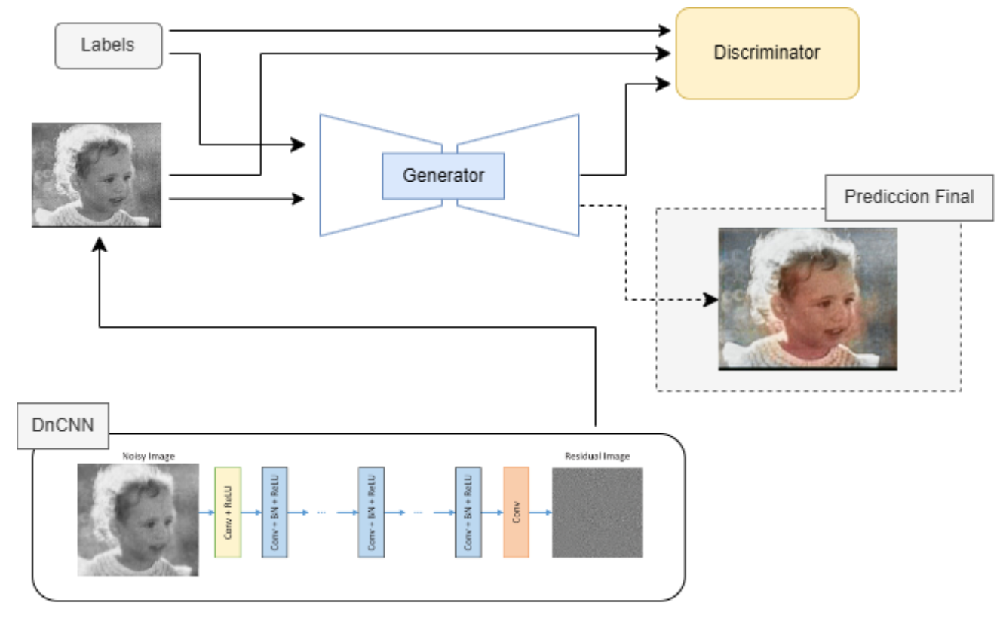

# Image Colorization and Denoising with Pix2Pix and DnCNN

### Authors
This repository was made by:
 - Antonio Tepsich | atepsich@udesa.edu.ar 
 - Maximo Gubitosi | mgubitosi@udesa.edu.ar 
 
### Adviser
<!-- PONER LO DE TRINI -->
 - Trinidad Monreal | tmonreal@udesa.edu.ar 

## Report in Spanish
You can view the full [report here](docs/Tepsich_Gubitosi_Informe_TP.pdf)

# Abstract
We developed and applied deep learning models to colorize black-and-white images, specifically using a DnCNN for noise reduction and a cGAN generator for colorization. Our study demonstrates that it is possible not only to convincingly restore colors but also to improve the visual quality of historical images, surpassing the limitations of their time. Despite certain limitations related to generalization in varied backgrounds and the quality of our own dataset images, the models showed significant ability to produce high-quality images.

# Motivation
The intersection of memory and technological innovation drives our project, where we strive to keep precious moments alive. As technology has evolved, from canvases to photographs, many memories have been relegated to grayscale due to the limitations of the era, leaving the original colors forgotten. The goal of this work is to revive the colors of our family images, bringing them back to life with modern technology. 

# Results
<p align="center">
  
  
  
</p>

# Architecture


# Usage
### 1-Jupyter Notebook
Run the file: 
```image_colorization.ipynb```

### 2-Download the dataset from Kaggle
Enter your Kaggle Account and apiKey after executing this command:
```bash
python scripts/download_datasets.py
```
Example:
```bash
Your Kaggle username: XXXX
Your Kaggle Key: XXXXXXXXXXXXXXXXXX
```
If other dataset is wanted, search in the scripts folder.